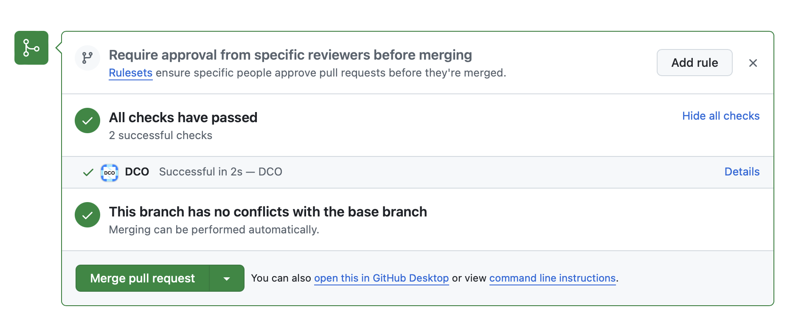
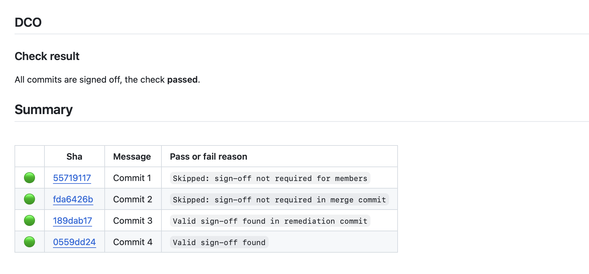
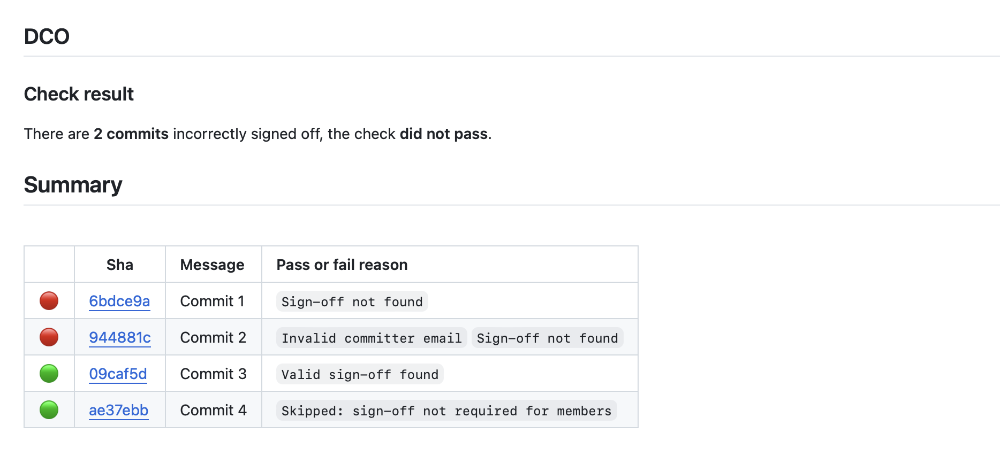

# DCO2

**DCO2** is a GitHub App that enforces the [Developer Certificate of Origin](https://developercertificate.org/) (DCO) on Pull Requests.

It aims to be a drop-in replacement for [dcoapp/app](https://github.com/dcoapp/app).

## Usage

To start using the DCO2 application, you need to [configure the application](https://github.com/apps/dco-2) for your organization or repositories. To enforce the DCO check, you can enable [required status checks](https://docs.github.com/en/repositories/configuring-branches-and-merges-in-your-repository/managing-protected-branches/about-protected-branches) in your branch protection settings.

## How it works

The [Developer Certificate of Origin](https://developercertificate.org) (DCO) is a lightweight way for contributors to certify that they wrote or otherwise have the right to submit the code they are contributing to the project.

Contributors *sign-off* that they adhere to [these requirements](https://developercertificate.org) by adding a `Signed-off-by` line to commit messages.

```text
Commit message

Signed-off-by: User1 <user1@email.test>
```

Git includes a `-s` command line option to append this line automatically to your commit message (provided you have configured your `user.name` and `user.email` in your git configuration):

```text
git commit -s -m 'Commit message'
```

Once installed, this application will create a check indicating whether or not all commits in a Pull Request contain a valid `Signed-off-by` line.



More information about the check result is available on the check details page. This information includes a full list of the commits checked (including the reason why each of them passed or failed the check), some additional details about each error found and some instructions on how to fix them.

*(check passed details)*



*(check failed details)*



### Remediation commits

Remediation commits allow applying a sign-off *retroactively* to one or more commits that failed the DCO check.

The primary benefit of using remediation commits to fix missing or invalid sign-offs, is that the repository's history does not change, and there is no risk of breaking someone else's work.

Remediation commits can be `individual` or `third-party`, and they **must** be properly signed off.

By default, both are **disabled**, but they can be enabled in the [configuration file](docs/config/dco.yml) (`.github/dco.yml`):

```yaml
allowRemediationCommits:
  individual: true
  thirdParty: true
```

> [!NOTE]
> The DCO2 configuration file is backwards compatible with the [dcoapp/app](https://github.com/dcoapp/app) configuration file. Note that third-party remediation requires individual remediation to be enabled in the configuration as well.

#### Individual

Individual remediation commits **must** be authored by the same person who authored the failing commit.

An individual remediation commit to add a sign-off to two commits created by `User1` would look like this:

```text
DCO remediation commit for User1 <user1@email.test>

I, User1 <user1@email.test>, hereby add my Signed-off-by to this commit: <COMMIT1_SHA>
I, User1 <user1@email.test>, hereby add my Signed-off-by to this commit: <COMMIT2_SHA>

Signed-off-by: User1 <user1@email.test>
```

#### Third-party

Third-party remediation commits **must** be authored by an authorized individual on behalf of the failing commit's author.

> [!IMPORTANT]
> If you are about to add a third-party DCO remediation commit under DCO section (b) or (c), be sure you are authorized by your employer to take this action. Generally speaking, maintainers and other project contributors cannot sign off on behalf of project contributors, unless there is some relationship which permits this action. It is your responsibility to verify this.

A third-party remediation commit to add a sign-off to two commits created by `User1` would look like this:

```text
Third-party DCO remediation commit for User1 <user1@email.test>

On behalf of User1 <user1@email.test>, I, user2 <user2@email.test>, hereby add my Signed-off-by to this commit: <COMMIT1_SHA>
On behalf of User1 <user1@email.test>, I, user2 <user2@email.test>, hereby add my Signed-off-by to this commit: <COMMIT2_SHA>

Signed-off-by: User2 <user2@email.test>
```

### Skipping sign-off for organization members

It is possible to disable the check for commits authored and [signed](https://help.github.com/articles/signing-commits-using-gpg/) by members of the organization the repository belongs to.

By default, this feature is **disabled**. To enable it, the following section must be added to the [configuration file](docs/config/dco.yml) (`.github/dco.yml`):

```yaml
require:
  members: false
```

When this setting is present on a repository that belongs to a single user (instead of an organization), only the repository owner is allowed to push commits without a sign-off.

## Deployment

We'll soon provide some documentation about how to deploy your own instance of DCO2.

## Contributing

Please see [CONTRIBUTING.md](./CONTRIBUTING.md) for more details.

## Code of Conduct

This project follows the [CNCF Code of Conduct](https://github.com/cncf/foundation/blob/master/code-of-conduct.md).

## License

**DCO2** is an Open Source project licensed under the [Apache License 2.0](https://www.apache.org/licenses/LICENSE-2.0).
